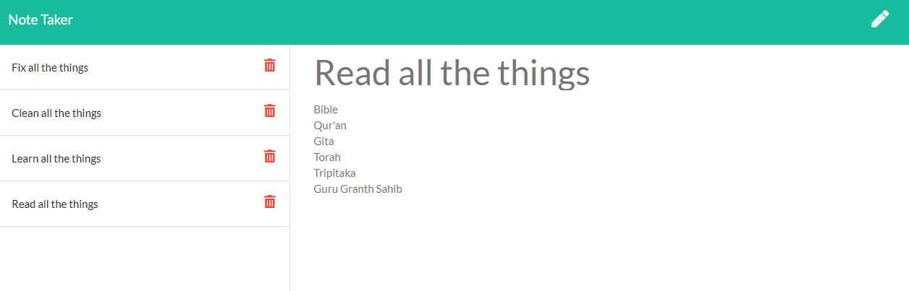

# Note Creator Express  
  
  
  
[Here is a link to the deployed app on heroku](https://note-creator-express.herokuapp.com/)

[Here is a link to the gitHub repo](https://github.com/brett-treweek/Express-Note-Taker)  


## Description
- This is a simple note taking app built with node.js. It uses the Express.js web framework to build the back end and it utilises the npm 'nanoid' to give unique ID's to each note which are then stored in a JSON file locally.  
- Functionally, this app alows for notes to be written, saved, deleted, and viewed.  


---
## Table of Contents

- [Installation](#installation)
- [Usage](#usage)
- [License](#license)
- [Contributing](#contributing)
- [Tests](#tests)
- [Questions](#questions)

---
## Installation  
  
Please follow these steps to install the project and any dependancies locally.

```bash
install node.js
clone the repo from gitHub
npm init
npm i express
npm i nanoid 

```

---
## Usage


This project has been deployed to Heroku. Check out this link to easily try the app. 
 
[Here is a link to a deployed app on heroku](https://note-creator-express.herokuapp.com/)

Run the app locally with the following command.   

    ```bash
    npm start
    ```


---
## License

This project is licensed under 

---
## Contributing

Contributing to this project is not currently available.

---
## Tests

Please use these commands to perform tests.

```bash

There are no tests at present.

```

---
## Questions

For any questions and support please contact Brett Treweek at bretttrew@gmail.com or message me through [GitHub](https://github.com/brett-treweek).